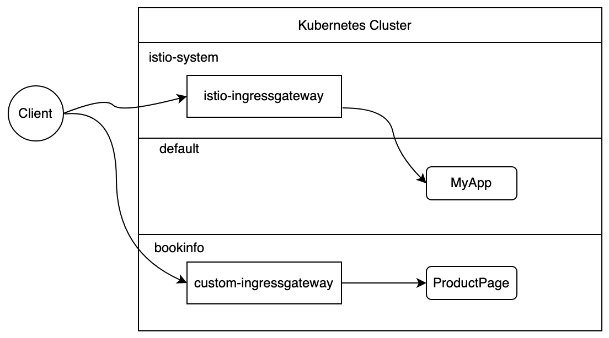

# Deploying your own Istio Ingress Gateway

### NOTE: 1.7 only

Managed Istio on IKS comes with a `istio-ingressgateway` deployment in the `istio-system` namespace which you can use for routing traffic coming in to your mesh. 
```
~ 🏎  $ kubectl get deploy -n istio-system
NAME                   READY   UP-TO-DATE   AVAILABLE   AGE
istio-egressgateway    2/2     2            2           138m
istio-ingressgateway   2/2     2            2           138m
istiod                 2/2     2            2           138m
```
It is exposed as a LoadBalancer service and is bound to a public IP address.
```
~ 🏎  $ kubectl get svc -n istio-system istio-ingressgateway
NAME                   TYPE           CLUSTER-IP       EXTERNAL-IP     PORT(S)                                                                                                                      AGE
istio-ingressgateway   LoadBalancer   172.21.191.13   169.63.158.243   15020:32189/TCP,80:32229/TCP,443:30727/TCP,15029:31567/TCP,15030:32151/TCP,15031:31829/TCP,15032:32446/TCP,31400:31871/TCP,15443:32171/TCP   139m
```
This Ingress Gateway is available to use for all workloads in the mesh via the `Gateway` resource. For example:
```
apiVersion: networking.istio.io/v1alpha3
kind: Gateway
metadata:
  name: bookinfo-gateway
spec:
  selector:
    istio: ingressgateway # <-- 
  servers:
  - port:
      number: 80
      name: http
      protocol: HTTP
    hosts:
    - "*"
```
This means, all traffic coming into the mesh will flow thru this `istio-ingressgateway` deployment. 


### Additional Gateways

For the following reasons, some users choose to create additional ingress gateway deployments. 
1. Separate traffic flows between certain workloads or namespaces
2. Modify Ingress Gateway with customizations.
3. Create an Ingress Gateway for private NLB traffic
4. Control version updates independently of Managed Istio updates. 



## Instructions
These steps will create a new Istio ingress gateway deployment in a `bookinfo` namespace and then deploy the BookInfo sample application to the same namespace.

1. Enable Managed Istio 1.7
1. Create a new namespace and enable automatic sidecar injection
```
kubectl create namespace bookinfo
kubectl label namespace bookinfo  istio-injection=enabled
```
3. Verify `istioctl version` shows same version for everything
4. Create a file called `custom-ingress-io.yaml` with contents:
```
apiVersion: install.istio.io/v1alpha1
kind: IstioOperator
metadata:
  namespace: ibm-operators
  name: example-custom-ingressgateway
spec:
  profile: empty
  hub: icr.io/ext/istio
  # tag: 1.7.1 # Force the Gateway to a specific version
  revision: custom-ingressgateway
  components:
    ingressGateways:
      - name: custom-ingressgateway
        label: 
          istio: custom-ingressgateway
        namespace: bookinfo
        enabled: true
```
5. Apply the above `IstioOperator` CR to your cluster. The Managed Istio operator running in the `ibm-operators` namespace will read the resource and install the Gateway Deployment and Service into the `bookinfo` namespace. 
```
kubectl apply -f ./custom-ingress-io.yaml
```
6. Check the deployments and services in `bookinfo` namespace. You should see the new gateway deployed. 
```
kubectl get deploy,svc -n bookinfo
```
```
NAME                                    READY   UP-TO-DATE   AVAILABLE   AGE
deployment.apps/custom-ingressgateway   1/1     1            1           4m53s

NAME                            TYPE           CLUSTER-IP      EXTERNAL-IP     PORT(S)                                                                                                                                      AGE
service/custom-ingressgateway   LoadBalancer   172.21.98.120   52.117.68.222   15020:32656/TCP,80:30576/TCP,443:32689/TCP,15029:31885/TCP,15030:30198/TCP,15031:32637/TCP,15032:30869/TCP,31400:30310/TCP,15443:31698/TCP   4m53s

```
7. Deploy the bookinfo sample.
```
kubectl apply -n bookinfo -f https://raw.githubusercontent.com/istio/istio/release-1.7/samples/bookinfo/platform/kube/bookinfo.yaml
```
8. Deploy Gateway and Virtual Service. Create a file called `bookinfo-custom-gateway.yaml` with contents:
```
apiVersion: networking.istio.io/v1alpha3
kind: Gateway
metadata:
  name: bookinfo-gateway
spec:
  selector:
    istio: custom-ingressgateway ### use the new gateway you just created
  servers:
  - port:
      number: 80
      name: http
      protocol: HTTP
    hosts:
    - "*"
---
apiVersion: networking.istio.io/v1alpha3
kind: VirtualService
metadata:
  name: bookinfo
spec:
  hosts:
  - "*"
  gateways:
  - bookinfo-gateway
  http:
  - match:
    - uri:
        exact: /productpage
    - uri:
        prefix: /static
    - uri:
        exact: /login
    - uri:
        exact: /logout
    - uri:
        prefix: /api/v1/products
    route:
    - destination:
        host: productpage
        port:
          number: 9080
```
Note that we are specifying `istio: custom-ingressgateway` in the Gateway.

9. Apply the Gateway and VirtualService resource
```
kubectl apply -f bookinfo-custom-gateway.yaml -n bookinfo
```

10. Get the EXTERNAL-IP of the `custom-ingressgateway` service in the `bookinfo` namespace
```
kubectl get svc -n bookinfo
```

11. Visit http://EXTERNAL-IP/productpage


## Creating an Ingress Gateway with private IP

VLAN provides subnets that are used to assign IP addresses to your worker nodes and public app services. By default, standard IKS clusters are connected to both [public and private VLANs](https://cloud.ibm.com/docs/containers?topic=containers-subnets#basics_vlans). The default Istio ingressgateway service will be assigned a public IP from the public VLAN.

Note: If you configure the worker nodes to only be connected to [private VLANs only](https://cloud.ibm.com/docs/containers?topic=containers-clusters), a private IP from the private VLAN is automatically created for default istio ingress gateway. 

To create a new Istio ingress gateway and specify a private IP, use the following spec for `custom-ingress-io.yaml` in the [instructions](#instructions):

```
apiVersion: install.istio.io/v1alpha1
kind: IstioOperator
metadata:
  namespace: ibm-operators
  name: example-custom-ingressgateway
spec:
  profile: empty
  hub: icr.io/ext/istio
  # tag: 1.7.1 # Force the Gateway to a specific version 
  revision: custom-ingressgateway
  components:
    ingressGateways:
      - name: custom-ingressgateway
        label: 
          istio: custom-ingressgateway
        namespace: bookinfo
        enabled: true
        k8s:
          serviceAnnotations:
            service.kubernetes.io/ibm-load-balancer-cloud-provider-ip-type: private
```

## Control Istio Gateway updates and version

Managed Istio automatically applies patch (major.minor.patch) updates to the Gateway components. For example, when Managed Istio 1.7.2 is released, all the Istio control plane and gateway pods get updated from 1.7.1. to 1.7.2 automatically. The update is done using a rolling update strategy to avoid downtime. However, it might be desirable for you to control when the update occurs so that you can stop production traffic to the cluster during the upgrade to avoid any downtime. This also allows you to test for any potential regressions with the new version.

To prevent Managed Istio from automatically updating the Gateways, create a custom gateway using the instructions above, and specify the `tag` to a version at or below the control plane version as shown in `istioctl version`

When the control plane is updated by Managed Istio, update the IstioOperator to the same version and re-apply. 

Note:
- Do not set the tag to a version newer than the control plane. 
- Running older version of a Gateway can expose you to security vulnerabilities. 

## Disable the default Ingress Gateway

To disable the default `istio-ingressgateway` Ingress Gateway in the `istio-system` namespace created by Managed Istio, use the `managed-istio-custom` config map to set `istio-ingressgateway-public-1-enabled: false` as documented [here](https://cloud.ibm.com/docs/containers?topic=containers-istio#customize).

## Clean up

Remove the `IstioOperator` resource
```
kubectl delete -f ./custom-ingress-io.yaml
```
