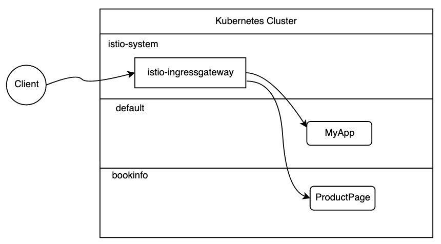
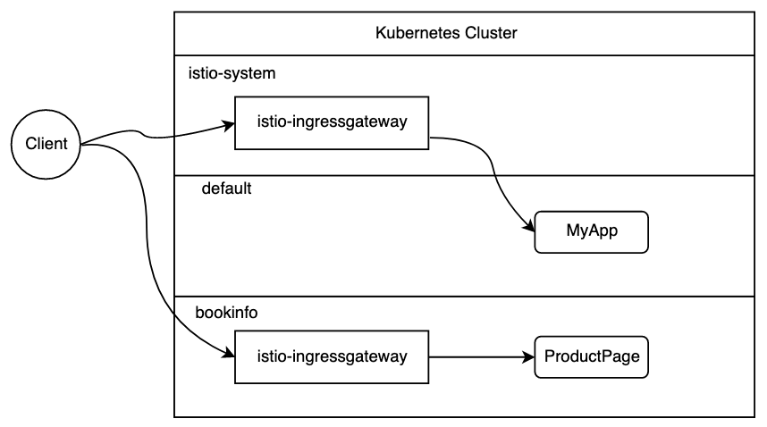

# Deploying your own Istio Ingress Gateway

Managed Istio on IKS comes with a `istio-ingressgateway` deployment in the `istio-system` namespace which you can use for routing traffic coming in to your mesh. 
```
~ 🏎  $ kubectl get deploy -n istio-system
NAME                     READY   UP-TO-DATE   AVAILABLE   AGE
grafana                  1/1     1            1           41d
istio-citadel            1/1     1            1           41d
istio-egressgateway      2/2     2            2           41d
istio-galley             1/1     1            1           41d
istio-ingressgateway     2/2     2            2           41d  <---
istio-pilot              1/1     1            1           41d
istio-policy             1/1     1            1           41d
istio-sidecar-injector   1/1     1            1           41d
istio-telemetry          1/1     1            1           41d
istio-tracing            1/1     1            1           41d
kiali                    1/1     1            1           41d
prometheus               1/1     1            1           41d
```
It is exposed as a LoadBalancer service and is bound to a public IP address.
```
~ 🏎  $ kubectl get svc -n istio-system istio-ingressgateway
NAME                   TYPE           CLUSTER-IP       EXTERNAL-IP     PORT(S)                                                                                                                      AGE
istio-ingressgateway   LoadBalancer   172.21.243.213   52.111.66.222   15020:32168/TCP,80:30110/TCP,443:32149/TCP,15029:30484/TCP,15030:32043/TCP,15031:30774/TCP,15032:30929/TCP,15443:31217/TCP   41d
```
This Ingress Gateway is available to use for all workloads in the mesh via the `Gateway` resource. For example:
```
apiVersion: networking.istio.io/v1alpha3
kind: Gateway
metadata:
  name: bookinfo-gateway
spec:
  selector:
    istio: ingressgateway # <--
  servers:
  - port:
      number: 80
      name: http
      protocol: HTTP
    hosts:
    - "*"
```
This means, all traffic coming into the mesh will flow thru this `istio-ingressgateway` deployment. 



### Additional Gateways

For the following reasons, some users choose to create additional ingress gateway deployments. 
1. Separate traffic flows between certain workloads or namespaces
2. Modify Ingress Gateway with customizations such as SDS.
3. Create an Ingress Gateway for private NLB traffic


## Instructions
These steps will create a new Istio ingress gateway deployment in a `bookinfo` namespace and then deploy the BookInfo sample application to the same namespace.

1. Download the Istio release and add `istioctl` to your PATH https://istio.io/docs/setup/getting-started/#download
2. Create a new namespace and enable automatic sidecar injection
```
kubectl create namespace bookinfo
kubectl label namespace bookinfo  istio-injection=enabled
```
3. Create a file called `customingress.yaml` with contents:
```
apiVersion: install.istio.io/v1alpha2
kind: IstioControlPlane
spec:
  trafficManagement:
    enabled: false
  policy:
    enabled: false
  telemetry:
    enabled: false
  security:
    enabled: false
  configManagement:
    enabled: false
  autoInjection:
    enabled: false
  gateways:
    components:
       ingressGateway:
         enabled: true
         namespace: bookinfo # <-- Specify the namespace where the ingress gateway deployment should go
       egressGateway:
         enabled: false
  values:
    prometheus:
      enabled: false
```
4. Apply the above resource:
```
istioctl manifest apply -f customingress.yaml
```
You should see:
```
- Applying manifest for component Base...
✔ Finished applying manifest for component Base.
- Applying manifest for component IngressGateway...
✔ Finished applying manifest for component IngressGateway.


✔ Installation complete
```
5. Check the deployments and services in `bookinfo` namespace. 
```
k get deploy -n bookinfo
```
```
NAME                   READY   UP-TO-DATE   AVAILABLE   AGE
istio-ingressgateway   1/1     1            1           56m

NAME                           TYPE           CLUSTER-IP      EXTERNAL-IP     PORT(S)                                                                                                                      AGE                                                                                                                    56m
service/istio-ingressgateway   LoadBalancer   172.21.169.93   52.117.68.220   15020:30828/TCP,80:30154/TCP,443:32100/TCP,15029:32603/TCP,15030:31219/TCP,15031:30466/TCP,15032:30081/TCP,15443:30068/TCP   56m
```
6. Deploy the bookinfo sample.
```
kubectl apply -n bookinfo -f ./samples/bookinfo/platform/kube/bookinfo.yaml
kubectl apply -n bookinfo -f ./samples/bookinfo/networking/bookinfo-gateway.yaml
```
7. Get the EXTERNAL-IP of the `istio-ingressgateway` service in the `bookinfo` namespace
```
kubectl get svc -n bookinfo
```
8. Visit http://EXTERNAL-IP/productpage

If you look the `Gateway` resource, you will find the istio controller selector:
```
  selector:
    istio: ingressgateway
```
Both the `istio-ingressgateway` deployments in `istio-system` and `bookinfo` namespaces share the same name. The Gateway resource will use the ingressgateway in the SAME namespace (`bookinfo`) instead of the global one namespace (`istio-system`).



## Enabling Ingress Gateway SDS

## Creating an Ingress Gateway per zone for HA

```
apiVersion: install.istio.io/v1alpha2
kind: IstioControlPlane
spec:
  trafficManagement:
    enabled: false
  policy:
    enabled: false
  telemetry:
    enabled: false
  security:
    enabled: false
  configManagement:
    enabled: false
  autoInjection:
    enabled: false
  gateways:
    components:
       ingressGateway:
         enabled: true
         namespace: bookinfo # <-- Specify where you want the gateway
       egressGateway:
         enabled: false
  values:
    prometheus:
      enabled: false
    gateways:
      istio-ingressgateway:
        serviceAnnotations:
          service.kubernetes.io/ibm-load-balancer-cloud-provider-zone: "dal12"  <-- Specify zone affinity
```
4. Apply the above resource:
```
istioctl manifest apply -f customingress.yaml
```

## Creating an Ingress Gateway with private IP

```
apiVersion: install.istio.io/v1alpha2
kind: IstioControlPlane
spec:
  trafficManagement:
    enabled: false
  policy:
    enabled: false
  telemetry:
    enabled: false
  security:
    enabled: false
  configManagement:
    enabled: false
  autoInjection:
    enabled: false
  gateways:
    components:
       ingressGateway:
         enabled: true
         namespace: bookinfo # <-- Specify where you want the gateway
       egressGateway:
         enabled: false
  values:
    prometheus:
      enabled: false
    gateways:
      istio-ingressgateway:
        serviceAnnotations:
          service.kubernetes.io/ibm-load-balancer-cloud-provider-ip-type: private
```
4. Apply the above resource:
```
istioctl manifest apply -f customingress.yaml
```