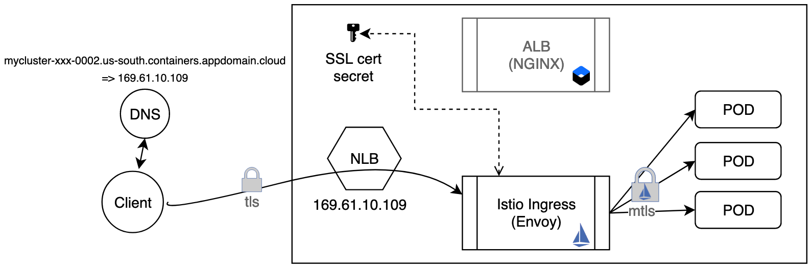

# End-to-end encryption of ingress traffic with Istio Ingress Gateway on IKS

There are a couple of different methods of exposing your Istio Ingress Gateway for external users. On this page, I'll cover the approach of securely connecting the NLB provided by the IBM Cloud Kubernetes Service directly to the Istio Ingress Gateway, skipping the Ingress application load balancer (ALB) provided by IKS. 



## Overview
1. The Network Load Balancer NLB serves as the external entry point for incoming requests for the app using one of the portable public IP addresses. The Istio Ingress Gateway service is already exposed as a LoadBalancer service.
2. Create a DNS host name `ibmcloud ks nlb-dns-create` for the Istio Ingress Gateway NLB IP. IKS registers the host name, creates TLS certificates and stores them as a secret in the default namespace.
3. Copy the TLS cert secret from the default namespace to the istio-system namespace and name it istio-ingressgateway-certs. Istio Ingress Gateway will use these certs to perform TLS termination. 
4. Enable Istio mesh wide encryption to achieve mTLS inside the cluster. The cert management is handled by Istio.


## Try it out

### Install Istio & BookInfo
1. Create an IKS cluster.
2. Install Istio and the BookInfo sample using the instructions from istio.io or by using the IKS Managed Istio add-on.
3. Get the External IP of your Istio Ingress Gateway and set it to an environment variable for convinience.
    ```
    export INGRESS_IP=$(kubectl -n istio-system get service istio-ingressgateway -o jsonpath='{.status.loadBalancer.ingress[0].ip}')
    echo $INGRESS_IP
    ```
4. Confirm a working Bookinfo by going to http://<INGRESS_IP>/productpage 


### Create a host name for Istio Ingress IP
1.  Use the nlb-dns-create command to create a DNS host name to register the NLB IP of the Istio Ingress Gateway service
    ```
    ibmcloud ks nlb-dns create classic --cluster <YOUR_CLUSTER-NAME> --ip $INGRESS_IP
    ```
2. Confirm it's working by accessing your BookInfo application in your browser. (HTTPS will not work yet) `http://<host_name>/productpage`

### Configure Istio Ingress Gateway for TLS termination
1. List the NLB host names for your cluster and get the secret name for the host you created in the previous step. Look for the `SSL Cert Secret Name` field.
   ```
   ibmcloud ks nlb-dnss --cluster rvennammanagedistio
   ```
2. Download the secret 
   ```
   kubectl get secret <SECRET_NAME> --namespace=default --export -o yaml > mysecret.yaml
   ```
3. Open the yaml file, find the `name:` field and change the value to `istio-ingressgateway-certs`
4. Create the secret
   ```
   kubectl apply -f ./mysecret.yaml -n istio-system
   ```
5. Restart the Istio Ingress Pods
   ```
   kubectl delete pod -n istio-system -l istio=ingressgateway
   ```

**NOTE** The certificates expire every 90 days and are automatically renewed by IKS 37 days before they expire. Only the secret in the default namespace will be updated, but you will have to manually copy the secret over every time it's updated. Use scripts to automate this and keep the secrets in sync. 


### Configure BookInfo Gateway to use tls
1. Delete the existing BookInfo Gateway
   ```
   kubectl delete gateway bookinfo-gateway
   ```
2. Apply this gateway which is configured for https and tls
```
apiVersion: networking.istio.io/v1alpha3
kind: Gateway
metadata:
  name: bookinfo-gateway
spec:
  selector:
    istio: ingressgateway # use istio default ingress gateway
  servers:
  - port:
      number: 443
      name: https
      protocol: HTTPS
    tls:
      mode: SIMPLE
      serverCertificate: /etc/istio/ingressgateway-certs/tls.crt
      privateKey: /etc/istio/ingressgateway-certs/tls.key
    hosts:
    - "*"
```

1. Confirm TLS is working by accessing your BookInfo application in your browser. (**HTTPS** this time!) `https://<host_name>/productpage`

### Enable mTLS for in-cluster traffic
1. Set a mesh-wide authentication policy. This configures the receiving side to use mutual TLS:
    ```
    kubectl apply -f - <<EOF
    apiVersion: "authentication.istio.io/v1alpha1"
    kind: "MeshPolicy"
    metadata:
    name: "default"
    spec:
    peers:
    - mtls: {}
    EOF
    ```
2. Configure the client side using the *.local to match all services
    ```
    kubectl apply -f - <<EOF
    apiVersion: "networking.istio.io/v1alpha3"
    kind: "DestinationRule"
    metadata:
    name: "default"
    namespace: "istio-system"
    spec:
    host: "*.local"
    trafficPolicy:
        tls:
        mode: ISTIO_MUTUAL
    EOF
    ```


    That's it! The end-to-end traffic from an external client to your services in the cluster is encrypted.
